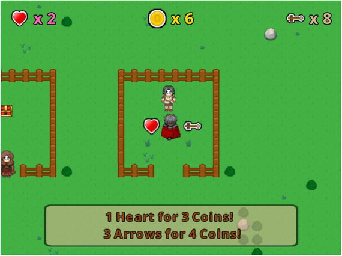

# Treasure Quest

Treasure Quest is an adventure game where the character, called the hero, is called upon to rid the land of flying bat-like creatures (called Flyers) and is promised a treasure chest as a reward.



## Game Controls
- **Moves the hero**: Up, Down, Left, Right or A, W, D, S keys 
- **Wings the sword**: X or J key. 
- **Shoots arrow**: C or K key. 
- **Buy shop items**: B key. 

## Running the Game

You must have JAVA version 11 (or higher) installed on your computer.

From source code:

```
./gradlew lwjgl3:run
```
From JAR file:

```
java -jar treasurequest-{version}.jar
```
Download the latest released `jar` file from:<br>
https://github.com/mariorez/libktx-treasure-quest/releases/

## Technologies

- **Kotlin** 1.7.10: https://kotlinlang.org
- **JDK** Temurin 11: https://adoptium.net
- **Gradle** Wrapper 7.5.1: https://gradle.org
- **LigKTX** 11.11.0-rc1: https://libktx.github.io
- **LigGDX** 1.11.0: https://libgdx.com
- **Fleks ECS Library** 2.0: https://github.com/Quillraven/Fleks
- Project generated with **GDX Liftoff**: https://github.com/tommyettinger/gdx-liftoff

## Disclaimer

This "framework" is the result of reading, studying and learning the examples shown in the book "**Java Game Development with LibGDX**" by the author Lee Stemkoski.

- **Book site**: https://www.apress.com/gp/book/9781484233238
- **Source-code**: https://github.com/Apress/java-game-dev-LibGDX
